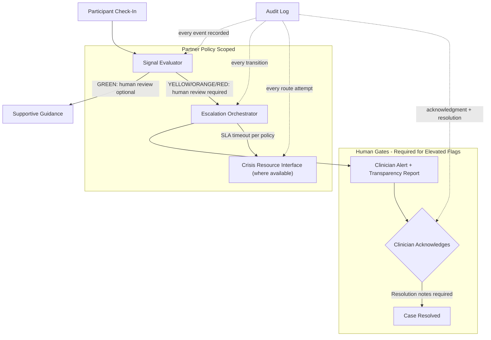

# AcuityBridge Safety & Escalation Orchestrator

[](https://github.com/devenchawla009/AcuityBridge/actions/workflows/ci.yml)


## A. Purpose

AcuityBridge Safety & Escalation Orchestrator is an open-source Python framework for human-in-the-loop decision-support workflows in care settings. It provides policy-driven workflow risk flagging, transparent escalation to licensed clinicians, and append-only, tamper-evident audit logging -- designed to support oversight continuity between clinical visits under clinician supervision.

The project addresses a structural gap in care delivery: between scheduled appointments, there is often no systematic mechanism for monitoring participant well-being, detecting early warning signs, or routing concerns to the appropriate human professional. This orchestrator provides the workflow scaffolding -- signal evaluation, escalation state management, clinician notification, and governance logging -- to support that continuity. It does not replace clinical judgment; it supports it.

---

## B. Why This Is Partnership-Driven (Not Single-Employer)

This framework is designed to be deployed across clinics, employers, community organizations, and other care settings -- each with distinct operational requirements:

- **Configurable workflows per partner policy.** Each organization defines its own escalation thresholds, crisis resource routing, consent model, clinician acknowledgment SLAs, and notification channels. See [`examples/partner_policies.yaml`](examples/partner_policies.yaml) for sample configurations spanning a community health center, a VA-affiliated facility, and a corporate EAP.

- **Multi-tenant isolation by design.** All data, audit entries, and escalation cases are scoped by organization ID. A policy registered for Organization A cannot affect Organization B's participants or data.

- **Not a fixed job description.** Deploying this system requires iterative pilots with each partner -- understanding their populations, adapting thresholds, validating workflows, executing BAAs, and refining safety protocols. This is founder-led, multi-partner work that spans organizations, states, and care contexts.

- **Phased validation required.** Each partner deployment follows a structured pilot playbook (sandbox, limited pilot, expansion) with continuous clinician feedback. See [`docs/05_pilot_playbook.md`](docs/05_pilot_playbook.md).

---

## C. Quickstart

### Option 1: Docker (recommended)

```bash
docker compose up
```

This builds the container and runs the synthetic scenario demo (~2 minutes).

### Option 2: Local Python

```bash
# Clone the repository
git clone https://github.com/devenchawla009/acuitybridge-safety-escalation-orchestrator.git
cd AcuityBridge

# Install dependencies
pip install -e ".[dev]"

# Run the synthetic demo
python examples/synthetic_scenario.py

# Run the test suite
python -m pytest tests/ -v
```

Both paths use entirely synthetic data. No real participant data, PHI, or PII.

---

## D. Architecture



**Key architectural properties:**

| Property | Implementation |
|----------|---------------|
| Human-in-the-loop | Escalation requires clinician acknowledgment; no autonomous action on elevated flags |
| Multi-tenant isolation | All data scoped by `org_id`; policies enforce organizational boundaries |
| Tamper-evident audit | SHA-256 hash-chained append-only log; `verify_chain()` detects modifications |
| Partner-configurable | Thresholds, SLAs, crisis targets, consent models -- all per-org |
| State machine enforcement | Escalation states cannot be skipped; transitions are validated |

For the full system architecture diagram and detailed component documentation, see [`docs/01_architecture.md`](docs/01_architecture.md).

---

## E. Security & Privacy Highlights

- **RBAC** -- Four roles (PARTICIPANT, CLINICIAN, ADMIN, AUDITOR) with enforced permission boundaries
- **Append-only audit log** -- Hash-chained with SHA-256; tamper-evident (see honest scope note in [`audit.py`](acuitybridge/audit.py))
- **PHI redaction** -- Automated stripping of PHI patterns (SSN, DOB, email, phone) before any audit export
- **Synthetic data only** -- All examples, tests, and demos use entirely synthetic data; no real PHI in this repository
- **Encryption assumptions** -- Production deployments should use encryption at rest and in transit; see [`docs/03_security_privacy.md`](docs/03_security_privacy.md)
- **Data minimization** -- Configurable retention windows per partner policy (minimum 30 days)

Full details: [`docs/03_security_privacy.md`](docs/03_security_privacy.md)

---

## F. Evidence-Friendly Metrics

| Metric | Status |
|--------|--------|
| CI pipeline | GitHub Actions on every push/PR |
| Test suite | 84 tests across 7 test modules |
| Test coverage | All modules covered (config, escalation, audit, signal evaluator, crisis router, transparency report, RBAC) |
| Release versioning | Semantic versioning (current: v0.1.0) |
| License | Apache 2.0 (open-source, enables peer review and adoption) |

### Evidence Snapshot Checklist

For petition assembly, the following artifacts are available:

- [ ] GitHub Releases page screenshot
- [ ] CI passing badge (see top of this README)
- [ ] [`docs/00_national_benefit_summary.md`](docs/00_national_benefit_summary.md) -- National benefit summary document
- [ ] Architecture diagram (this README + [`docs/01_architecture.md`](docs/01_architecture.md))
- [ ] Pilot playbook ([`docs/05_pilot_playbook.md`](docs/05_pilot_playbook.md))
- [ ] Sample audit export output (run `python examples/synthetic_scenario.py`)

---

## G. Disclaimers

**This software is not a medical device.** It is not intended to diagnose, treat, cure, or prevent any disease or condition. It does not provide clinical assessments, risk stratification, or emergency services. It is designed exclusively to support decision-support workflows under the direct supervision of licensed healthcare professionals.

**All elevated workflow flags (YELLOW, ORANGE, RED) require human review before any action is taken.** GREEN flags may proceed without mandatory review.

**Crisis resource interfaces are integration stubs.** They do not guarantee connection to emergency services. Partners define operational crisis protocols; this project provides interface hooks and audit logging, not emergency service operations.

**All data in this repository is synthetic.** No real participant data, PHI, or PII is present.

For full details, see [`docs/07_limitations_and_disclaimers.md`](docs/07_limitations_and_disclaimers.md).

---

## Documentation

| Document | Description |
|----------|-------------|
| [`docs/00_national_benefit_summary.md`](docs/00_national_benefit_summary.md) | National benefit and labor certification waiver summary |
| [`docs/01_architecture.md`](docs/01_architecture.md) | System architecture and component boundaries |
| [`docs/02_deployment.md`](docs/02_deployment.md) | OCI reference deployment architecture |
| [`docs/03_security_privacy.md`](docs/03_security_privacy.md) | Security, privacy, and threat model |
| [`docs/05_pilot_playbook.md`](docs/05_pilot_playbook.md) | Partner pilot deployment guide |
| [`docs/06_roadmap_milestones.md`](docs/06_roadmap_milestones.md) | 30/60/90-day development roadmap |
| [`docs/07_limitations_and_disclaimers.md`](docs/07_limitations_and_disclaimers.md) | Limitations, disclaimers, and scope boundaries |

---

## License

Apache License 2.0. See [LICENSE](LICENSE).

Copyright 2026 Deven Chawla.
