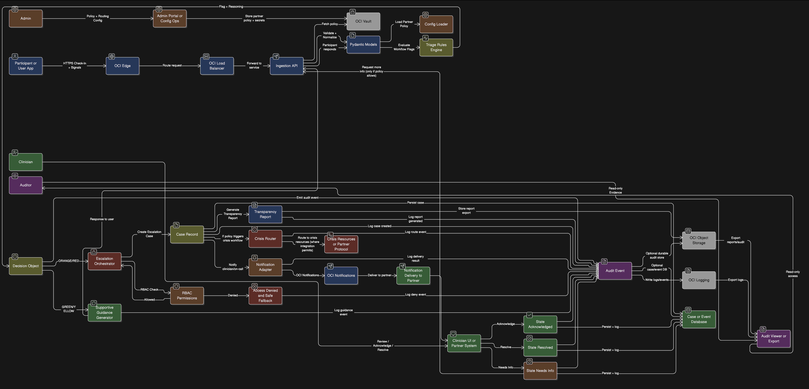
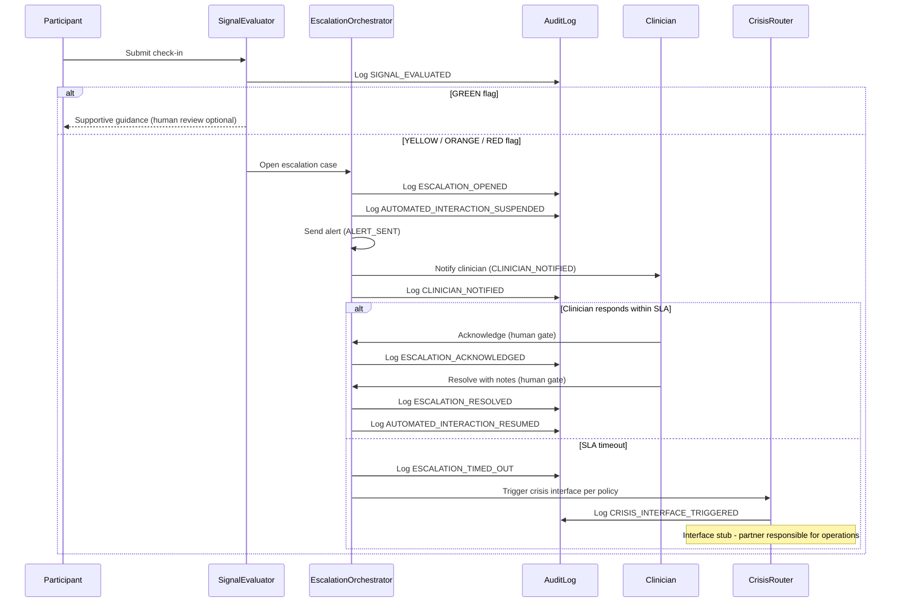

# Architecture: AcuityBridge Safety & Escalation Orchestrator

## Overview

This document describes the system architecture, component boundaries, event flows, and human approval gates of the AcuityBridge Safety & Escalation Orchestrator. It is intended for technical reviewers, clinical partners, and regulatory stakeholders evaluating the system's design rigor and safety properties.

**DISCLAIMER:** This software is not a medical device. It supports decision-support workflows under clinician supervision. All elevated flags require human review.

---

## Full System Architecture

The following diagram shows the complete end-to-end system architecture, including application-level workflow, infrastructure mapping, and data flows:

---

## Component Boundaries

Each module has an explicit responsibility and explicit scope limits:

| Module | Responsibility | Does NOT Do |
|--------|---------------|-------------|
| `config.py` | Partner policy registration, validation, multi-tenant isolation | Store policies persistently (in-memory registry; production would use a database) |
| `signal_evaluator.py` | Evaluate check-in signals against policy thresholds; produce workflow flags | Diagnose, assess, or classify conditions; provide clinical recommendations |
| `escalation.py` | Manage escalation lifecycle state machine; enforce human gates | Make clinical decisions; take autonomous action on elevated flags |
| `audit.py` | Record all events in append-only, hash-chained log; support export and verification | Guarantee immutability (see honest scope note); store data persistently beyond process lifetime |
| `crisis_router.py` | Provide interfaces for partner-configured crisis resource routing | Guarantee connection to emergency services; operate crisis protocols |
| `transparency_report.py` | Generate structured decision-support summaries for clinician review | Provide diagnoses or treatment recommendations |
| `rbac.py` | Enforce role-based permission checks on operations | Replace enterprise identity providers (demonstration-grade RBAC) |
| `models.py` | Define shared data structures (Participant, RiskFlag, CheckIn, etc.) | Contain business logic or make decisions |

---

## Event Flow

The following sequence diagram shows a complete workflow from participant check-in through escalation, clinician review, and resolution:

---

## Human Approval Gates

The following points in the workflow require mandatory human action before the system proceeds:

| Gate | Where | Enforcement |
|------|-------|-------------|
| **Escalation Acknowledgment** | `escalation.py: acknowledge()` | Only the assigned clinician can acknowledge; unauthorized attempts raise `UnauthorizedAcknowledgmentError` |
| **Case Resolution** | `escalation.py: resolve()` | Requires matching clinician ID and non-empty resolution notes; empty notes raise `ValueError` |
| **Elevated Flag Review** | All YELLOW/ORANGE/RED flags | Automated interaction is suspended on case open; resumed only after resolution |
| **Policy Configuration** | `config.py: PolicyRegistry` | Only ADMIN role can manage policies (enforced by `rbac.py`) |
| **Audit Export** | `audit.py: export_for_review()` | Only ADMIN and AUDITOR roles can export (enforced by `rbac.py`) |

**No autonomous action on elevated flags.** The system suspends automated interaction when any escalation case is open. Content delivery resumes only after a clinician resolves the case with documented notes.

---

## Audit Log Semantics

**Structure:** Each audit entry contains:
- Entry ID (UUID), timestamp (UTC ISO-8601)
- Organization ID (multi-tenant isolation key)
- Actor ID and role
- Event type (from 15 defined types)
- Target entity (participant, case, or policy ID)
- Metadata (event-specific details)
- Previous hash (SHA-256 of preceding entry)

**Hash chain:** Entries are linked via SHA-256 hashes. `verify_chain()` walks the entire log and detects any modification. This provides structural tamper evidence.

**Honest scope note:** This hash chain is a demonstration mechanism. Production deployment would use WORM (Write Once Read Many) storage, object-lock, or a cryptographic commitment scheme for stronger guarantees.

**Export:** `export_for_review()` produces a JSON bundle scoped by organization, with PHI redaction applied to all metadata. The export includes chain verification status.

---

## Multi-Tenant Isolation

Partner policies and all operational data are scoped by `org_id`:

- **Policy Registry:** Policies are keyed by `org_id`. `get()` returns a deep copy; mutations do not affect the registry.
- **Escalation Cases:** `open_case()` validates that participant `org_id` matches policy `org_id`. `check_sla_timeout()` rejects mismatched policies with `OrgMismatchError`.
- **Audit Log:** `query()` and `export_for_review()` filter by `org_id`. Entries from Organization A are never returned in queries for Organization B.
- **Crisis Routing:** Routes use the policy's configured crisis resource targets -- each organization defines its own.

---

## Integration Interfaces

The following integration points are defined as interfaces (stubs in the current implementation):

| Interface | Purpose | Status |
|-----------|---------|--------|
| Crisis resource routing | Route to partner-configured crisis resources (phone, webhook, internal queue) | Stub; emits audit events; partner responsible for operational readiness |
| Wearable data ingestion | Accept physiological readings (HRV, sleep, activity) from Apple HealthKit, Fitbit, etc. | Model defined (`BiomarkerReading`); ingestion pipeline planned for v0.2 |
| EHR integration (FHIR) | Bidirectional data exchange with Epic, Cerner via FHIR APIs | Planned for v1.0; not implemented in current release |
| Notification delivery | Send clinician alerts via SMS, email, webhook, dashboard | Interface defined in policy; delivery stubs in escalation module |

**These are interface definitions, not operational integrations.** Production deployment requires partner-specific configuration, BAAs, and security review for each integration.

---

*This document is part of the AcuityBridge technical documentation suite. For deployment architecture, see `docs/02_deployment.md`. For security details, see `docs/03_security_privacy.md`.*
