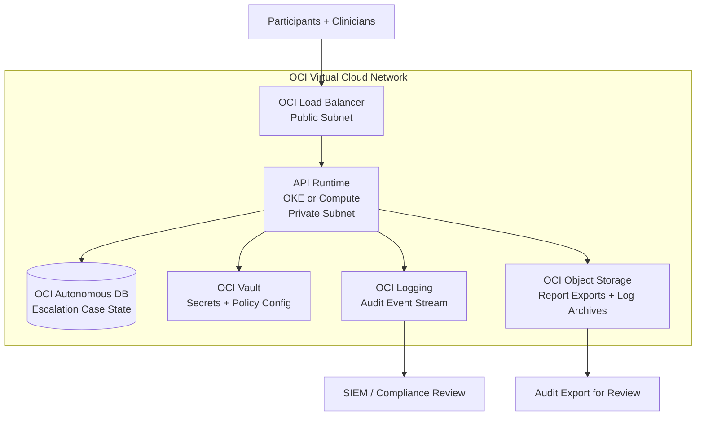

# Deployment Architecture: Oracle Cloud Infrastructure (OCI) Reference

## Overview

This document describes a reference deployment architecture for the AcuityBridge Safety & Escalation Orchestrator on Oracle Cloud Infrastructure (OCI). It maps each orchestrator component to specific OCI services, demonstrating how the system would operate in a production cloud environment.

This architecture leverages the Petitioner's direct experience engineering core services on Oracle Cloud Infrastructure, where he integrated with cloud storage, secrets management, and service-to-service authentication systems.

**DISCLAIMER:** This document describes a reference deployment architecture. Actual deployment requires partner-specific configuration, executed Business Associate Agreements (BAAs), security review, and compliance validation. This is not an operational deployment guide.

---

## Component Mapping

### Service-to-Component Mapping

| Orchestrator Component | OCI Service | Purpose |
|----------------------|-------------|---------|
| API runtime (orchestrator endpoints) | **OCI Container Engine for Kubernetes (OKE)** or **OCI Compute** | Hosts the escalation orchestrator, signal evaluator, and API layer. OKE provides auto-scaling and health monitoring. |
| Partner policy storage | **OCI Vault** | Stores partner-specific policy configurations and secrets (API keys, webhook credentials). Vault provides HSM-backed encryption and access controls. |
| Escalation case persistence | **OCI Autonomous Database** or **OCI MySQL Database Service** | Stores escalation case state, participant enrollment records, and check-in history. Autonomous Database provides automatic patching and encryption at rest. |
| Audit event stream | **OCI Logging** + **OCI Streaming** | Receives append-only audit events in real time. Streaming enables downstream consumers (SIEM, compliance dashboards) without modifying the primary log. |
| Transparency report exports | **OCI Object Storage** | Stores generated Decision Transparency Reports and audit export bundles. Object Storage supports versioning and retention policies for compliance. |
| Audit log archive | **OCI Object Storage** (with retention rules) | Long-term audit log storage with configurable retention. Object Storage retention rules can enforce WORM-like behavior for compliance. |
| Load balancing and TLS termination | **OCI Load Balancer** | Terminates TLS, distributes traffic across API instances, provides health checks. |
| Network isolation | **OCI Virtual Cloud Network (VCN)** | Private subnets for API and database; public subnet for load balancer only. Security lists restrict all traffic to required ports. |

---

## Security Architecture

| Layer | OCI Implementation |
|-------|-------------------|
| Encryption in transit | TLS 1.2+ at load balancer; mutual TLS between services where applicable |
| Encryption at rest | Autonomous Database and Object Storage encrypt by default; Vault provides HSM-backed key management |
| Identity and access | OCI IAM policies with least-privilege; service principals for inter-service auth |
| Network segmentation | VCN with public/private subnet separation; security lists and network security groups |
| Audit and monitoring | OCI Audit service for infrastructure events; application-level audit via `audit.py` |
| Compliance readiness | OCI services support healthcare compliance requirements; BAAs available where applicable |

---

## Why OCI

This reference architecture uses Oracle Cloud Infrastructure for specific reasons aligned with the Petitioner's background and the project's requirements:

1. **Petitioner's direct OCI experience.** The Petitioner served as Senior Member of Technical Staff at Oracle Cloud Infrastructure, where he integrated with cloud storage and secrets-management systems and implemented service-to-service authentication. This deployment architecture leverages that operational expertise.

2. **Healthcare workload support.** OCI supports healthcare workloads with BAA availability and compliance certifications relevant to care-setting deployments where applicable.

3. **FedRAMP availability.** For government and VA-affiliated partners, OCI's FedRAMP authorized regions provide the compliance posture required for deployment in federal healthcare settings.

4. **Cost efficiency for pilot deployments.** OCI's pricing model and always-free tier resources support the project's phased deployment strategy, enabling sandbox and limited pilot phases without prohibitive infrastructure costs.

---

## Deployment Phases

| Phase | Infrastructure | Scale |
|-------|---------------|-------|
| Sandbox (v0.1) | Single Compute instance; local SQLite or Autonomous DB free tier | 1 partner, synthetic data only |
| Limited Pilot (v0.2) | OKE cluster (2-3 nodes); Autonomous DB; Vault; Logging | 1-3 partners, 10-20 participants per partner |
| Production (v1.0) | Multi-AZ OKE; Autonomous DB with standby; Object Storage with retention; full Logging + Streaming pipeline | Multiple partners, national-scale |

---

*This document is part of the AcuityBridge technical documentation suite. For system architecture details, see `docs/01_architecture.md`. For security and privacy specifics, see `docs/03_security_privacy.md`.*
