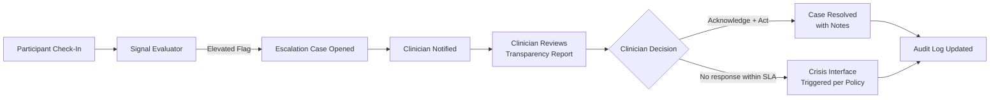

# Pilot Playbook: Partner Deployment Guide

## Overview

This playbook defines the steps required to deploy the AcuityBridge Safety & Escalation Orchestrator with a new partner organization. Each deployment follows a phased approach designed to validate safety, build clinical trust, and ensure regulatory compliance before expansion.

**DISCLAIMER:** This software is not a medical device. Pilot deployments operate under clinician supervision with human review of all elevated flags. Partners are responsible for their own clinical protocols, crisis operations, and regulatory compliance.

---

## Pre-Pilot Requirements

Before any deployment begins, the following must be completed:

### Administrative

- [ ] **Business Associate Agreement (BAA)** executed between AcuityBridge and the partner organization
- [ ] **Partner-specific policy configuration** reviewed and approved by partner clinical leadership (see `examples/partner_policies.yaml` for template)
- [ ] **IRB/Ethics review** completed where applicable (research use cases require institutional review board approval)
- [ ] **Data Processing Agreement** executed covering data handling, retention, and deletion responsibilities
- [ ] **Clinician oversight agreement** -- designated licensed clinician(s) confirmed for escalation review

### Technical

- [ ] **Deployment environment** provisioned (see `docs/02_deployment.md` for OCI reference architecture)
- [ ] **Network security review** completed for the deployment environment
- [ ] **Integration endpoints** configured (notification channels, crisis resource interfaces)
- [ ] **Access credentials** provisioned for clinician and admin roles (RBAC configuration)
- [ ] **Synthetic validation** -- full synthetic scenario run completed successfully in the partner's environment

---

## Phase 1: Sandbox (Weeks 1-2)

**Goal:** Validate that the system operates correctly with synthetic data in the partner's environment.

### Activities

- Deploy orchestrator with partner-specific policy configuration
- Run `examples/synthetic_scenario.py` end-to-end in the partner environment
- Clinicians review sample Decision Transparency Reports for clarity and usefulness
- Test all notification channels (dashboard alerts, SMS, webhooks as configured)
- Verify audit log recording and export functionality
- Validate RBAC permissions (clinicians can acknowledge; admins can manage policies; participants cannot access escalation data)

### Exit Criteria

- [ ] All synthetic tests pass in partner environment
- [ ] Clinician team confirms Transparency Report format is actionable
- [ ] Notification channels deliver alerts within expected timeframes
- [ ] Audit export produces valid, PHI-redacted JSON bundle
- [ ] Partner clinical leadership approves advancement to Phase 2

### Data

- **Synthetic only.** No real participant data is used in Phase 1.

---

## Phase 2: Limited Pilot (Weeks 3-6)

**Goal:** Validate the workflow with 10-20 participants under full clinician oversight.

### Activities

- Enroll 10-20 participants (under clinician oversight) with informed consent per partner policy
- Participants submit daily or weekly check-ins through the configured interface
- Signal evaluator processes check-ins; all elevated flags (YELLOW, ORANGE, RED) receive mandatory human review
- Clinicians review every escalation case through the Provider Dashboard
- Daily clinician review meetings during the first two weeks; weekly thereafter
- Monitor false-positive rate, escalation response time, and clinician workload impact
- Iterate on threshold configuration based on clinician feedback

### Human Oversight Workflow

### Exit Criteria

- [ ] All elevated flags reviewed by clinician within SLA window
- [ ] Escalation-to-acknowledgment time within partner's target (measured)
- [ ] False-positive rate within acceptable range (calibrated with clinician feedback)
- [ ] No safety incidents attributable to system behavior
- [ ] Clinician satisfaction survey completed (qualitative feedback)
- [ ] Partner clinical leadership approves advancement to Phase 3

### Data

- Real participant data under consent. PHI handling per BAA and partner policy. No PHI stored in the repository.

---

## Phase 3: Expansion (Weeks 7-12+)

**Goal:** Broader enrollment, outcome measurement, and iterative refinement.

### Activities

- Expand enrollment based on Phase 2 outcomes and partner capacity
- Adjust thresholds and SLA configurations based on accumulated data
- Begin measuring outcome metrics (escalation frequency trends, response times, participant engagement)
- Evaluate integration with partner's existing systems (EHR, internal dashboards)
- Document lessons learned for playbook refinement
- Prepare summary report for partner leadership and, where applicable, regulatory review

### Exit Criteria

- [ ] Outcome metrics demonstrate value (reduced monitoring burden, timely escalation, clinician efficiency)
- [ ] Partner signs off on operational deployment or continued pilot extension
- [ ] Lessons learned documented and incorporated into playbook

---

## Success Criteria (KPIs)

| Metric | Target | Measurement |
|--------|--------|-------------|
| Escalation acknowledgment time | Within partner-defined SLA | Audit log timestamps (CLINICIAN_NOTIFIED to ESCALATION_ACKNOWLEDGED) |
| False-positive rate | Below 20% of total escalations (Phase 2 calibration target) | Clinician resolution notes indicating no action needed |
| Clinician satisfaction | Positive qualitative feedback | Post-pilot survey |
| System availability | 99.5% uptime during pilot hours | Infrastructure monitoring |
| Audit chain integrity | 100% valid on every export | `verify_chain()` result in export metadata |
| Participant engagement | >70% check-in completion rate | Check-in submission logs |

---

## Rollback Plan

If at any point during the pilot the partner or clinical team identifies safety concerns:

1. **Immediately suspend** new enrollments
2. **Maintain** existing escalation monitoring until all open cases are resolved
3. **Clinician review** of all active cases within 24 hours
4. **Root cause analysis** conducted jointly by AcuityBridge and partner clinical team
5. **Decision** to modify and restart, or terminate the pilot

All actions are recorded in the audit log.

---

*This document is part of the AcuityBridge technical documentation suite. For system architecture, see `docs/01_architecture.md`. For roadmap and milestones, see `docs/06_roadmap_milestones.md`.*
